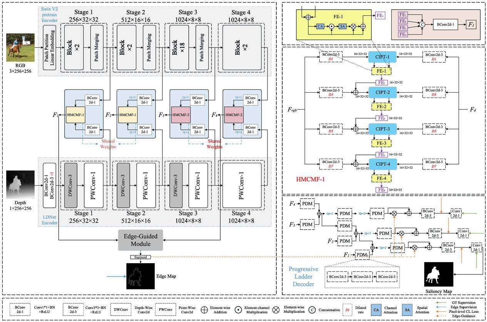
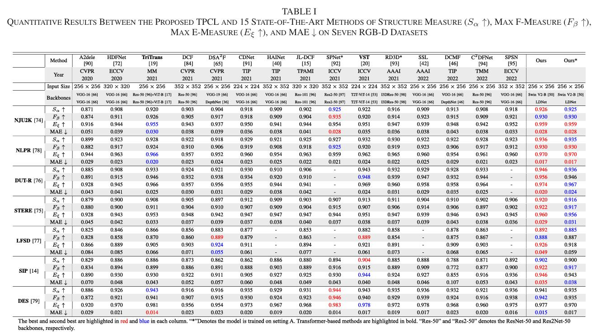
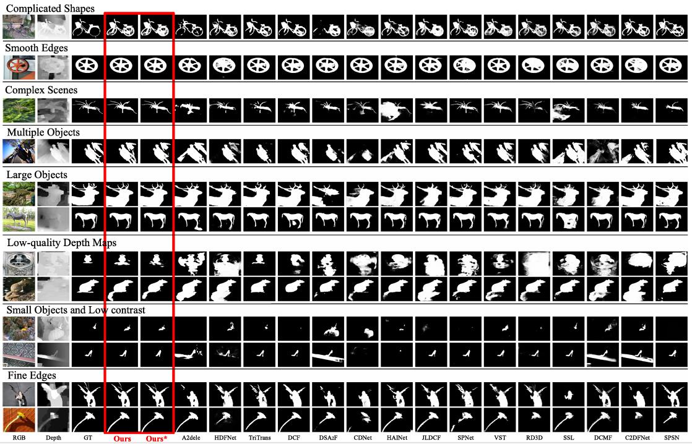

# Transformer Fusion and Pixel-Level Contrastive Learning for RGB-D Salient Object Detection (IEEE-TMM 2023)

> **Authors:** 
> Jiesheng Wu,
> Fangwei Hao,
> Weiyun Liang,
> and Jing Xu.

## 1. Preface

- This repository provides code for "_**Transformer Fusion and Pixel-Level Contrastive Learning for RGB-D Salient Object Detection**_" IEEE TMM 2023. [Paper](https://ieeexplore.ieee.org/document/10122979) 

## 2. Overview

### 2.1. Introduction
Current RGB-D salient object detection (RGB-D SOD) methods mainly develop a generalizable model trained by binary cross-entropy (BCE) loss based on convolutional or Transformer backbones. However, they usually exploit convolutional modules to fuse multi-modality features, with little attention paid to capturing the long-range multi-modality interactions for feature fusion. Furthermore, BCE loss does not explicitly explore intra- and inter-pixel relationships in a joint embedding space. To address these issues, we propose a cross-modality interaction parallel-transformer (CIPT) module, which better captures the long-range multi-modality interactions, generating more comprehensive fusion features. Besides, we propose a pixel-level contrastive learning (PCL) method that improves inter-pixel discrimination and intra-pixel compactness, resulting in a well-structured embedding space and a better saliency detector. Specifically, we propose an asymmetric network (TPCL)for RGB-DSOD, which consists of a SwinV2 transformer-based backbone and a designed lightweight backbone (LDNet). Moreover, an edge-guided module and a feature enhancement (FE) module are proposed to refine the learned fusion features. Extensive experiments demonstrate that our method achieves excellent performance against 15 state-of-the-art methods on seven public datasets. We expect our work to facilitate the exploration of applying Transformer and contrastive learning for RGB-D SOD tasks.

### 2.2. Framework Overview

      
    <em> 
    Figure 1: Overall architecture of our proposed TPCL. 
    </em>

### 2.3. Quantitative Results

      
    <em> 
    Figure 2: Quantitative Results
    </em>

### 2.4. Qualitative Results

      
    <em> 
    Figure 3: Qualitative Results.
    </em>

## 3. Proposed Method

### 3.1. Training/Testing

The training and testing experiments are conducted using [PyTorch](https://github.com/pytorch/pytorch) with a single NVIDIA GTX 3080Ti GPU of 12 GB Memory.

1. Configuring your environment (Prerequisites):
       
    + Installing necessary packages: `pip install -r requirements.txt`.

1. Downloading necessary data:

    + downloading training datasets and moving them into `./Datasets/`, 
    which can be found from [Baidu Drive](https://pan.baidu.com/s/1wYghUqcUt4ptsgNtCs3umA)  (extraction code: cvlm).

    + downloading testing datasets and moving them into `./Datasets/`, 
    which can be found from [Baidu Drive](https://pan.baidu.com/s/1S7qUTEEQ3fiVknBzksSdnw) (extraction code: rlb4). 

    + downloading our weights and move it into `./save_models/2985_L.pth` or `./save_models/2185_L.pth`, 
    which can be found from [(Baidu Drive)]() (extraction code: ). 
    
    + downloading Swin V2 weights and move it into `./pre_train/swinv2_base_patch4_window16_256.pth`,
    which can be found from [Baidu Drive](https://pan.baidu.com/s/1a2CiC2ptNhysKpYXpP4vIw) (extraction code:2vrr). 

1. Training Configuration:

    + After you download the training dataset, just run `train.py` to train our model.

1. Testing Configuration:

    + After you download all the pre-trained models and testing datasets, just run `test.py` to generate the final prediction maps.
    
    + You can also download prediction maps ('NJU2K', 'NLPR', 'DUT-RGBD', 'STERE', 'LFSD', 'SIP', 'DES') from [Baidu Drive]() (extraction code: )).

### 3.2 Evaluating your trained model:

One evaluation is written in MatLab codes ([link](https://drive.google.com/file/d/1-fXbORnXNVfvm7uarXLX6w9PuVhs-25d/view?usp=sharing)), 
please follow the instructions in `main.m` and just run it to generate the evaluation results.
We provide `quantitative results` and `.mat files`, please refer to the folder `Results`.

### 3.3 Parameters, FLOPs and FPS

We provide the parameters, FLOPs, and FPS of our model. FLOPs are measured when the input size is 256*256, and the FPS running speed is measured on a single 3080Ti GPU. Please refer to the `Para_FLOPs_FPS.txt file`. Note: We are very sorry that there were some minor errors in the parameters in our paper. During the test, we forgot to remove some layers that were not involved in the training. The actual parameters are `112.67M`.

## 4. Citation

Please cite our paper if you find the work useful, thanks! 
	
	@ARTICLE{10122979,
    author={Wu, Jiesheng and Hao, Fangwei and Liang, Weiyun and Xu, Jing},
    journal={IEEE Transactions on Multimedia}, 
    title={Transformer Fusion and Pixel-Level Contrastive Learning for RGB-D Salient Object Detection}, 
    year={2024},
    volume={26},
    number={},
    pages={1011-1026}}
**[⬆ back to top](#1-preface)**
